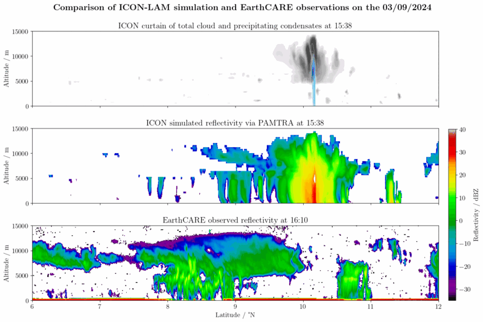

# EarthCARE-Curtains (hk25-Curtains)

The goal of this working group is to evaluate our models’ capability of capturing the correct vertical structure of clouds around the globe.

To this end, we propose to extract so-called “virtual curtains” from the simulations alongside the EarthCARE satellite tracks (see Fig. 1). “Curtains" refers to the shape of the dataset, a vertical veil unfolding under the satellite, while “virtual" refers to projection of these 2025 orbit tracks onto the simulated year 2020. Practically, we anticipate to use the upcoming EarthCARE's L2-products for the month of April 2025. We will therefore compare these with all virtual curtains extracted from April month, using a bulk statistical approach. Further, we intend to use the satellite product emulator PAMTRA to convert the model’s output into comparable products such as radar reflectivity. An example of such curtain extraction and conversion is presented in Fig. 2.

**Coordination**: Romain Fiévet (romain.fievet@mpimet.mpg.de)

#### Sketch of initial activities
* Recover the EC product and orbital tracks
* Extract the virtual curtain from the models
* Convert these using PAMTRA
* Compare and evaluate the models biases

